# WeVote weconnect-server

[](https://travis-ci.org/wevote/WebApp)

This **weconnect-server** git repository contains the code for WeVote's Node Javascript application server.
* Node is the interpreter/compiler for server based JavaScript (JavaScript not running in a browser).
* The **weconnect-server** 
   * is based on the excellent [Hackathon Starter](https://github.com/sahat/hackathon-starter) "A kickstarter for Node.js Web applications". (But we don't use it as a Web app.)
   * is a backend API server "written in Node" to support our React [weconnect](https://github.com/wevote/weconnect) front end client.
   * uses the Express.js application server to run our app, and serve up HTTP requests.
   * uses the Prisma.js ORM (Object Relational Model) to read and write from our PostgreSQL database server.
<br><br>

Interested in [volunteering or applying for an internship](https://wevote.applytojob.com/apply)? [Starting presentation here](https://prezi.com/p/6iu9aks7zqvs/?present=1).
Please also [read about our values](https://docs.google.com/document/d/12qBXevI3mVKUsGmXL8mrDMPnWJ1SYw9zX9LGW5cozgg/edit) and
[see our Code of Conduct](CODE_OF_CONDUCT.md)
To join us, please [review our openings here](https://wevote.applytojob.com/apply), and apply for a volunteer position through that page.

Our current version of our public facing web app is here [https://WeVote.US](https://WeVote.US) and we are working on a new version now!

# Installing the weconnect-server

These instruction assume that you are installing on a Mac.  If you use Windows or Linux, the installation procedure should be similar.

This procedure is based on using the free Community edition of WebStorm, which has great Git integration, a great integrated Node debugger, a built in terminal, and is an excellent editor.  
If you have the paid version of WebStorm the instructions should be the same.  
**If you have some other preferred editor, we recommend that you still do this install, and then use your other editor as you wish!** 
<br><br>

## If you don't already have one, create an account in [GitHub](https://github.com/)
[GitHub](https://github.com/) is where WeVote stores the source code for our various projects.
<br><br>

## Download and install WebStorm
The free Community edition is at https://www.jetbrains.com/webstorm/

License it as a free Community installation.

Once installed, start WebStorm from Launch Pad or Spotlight

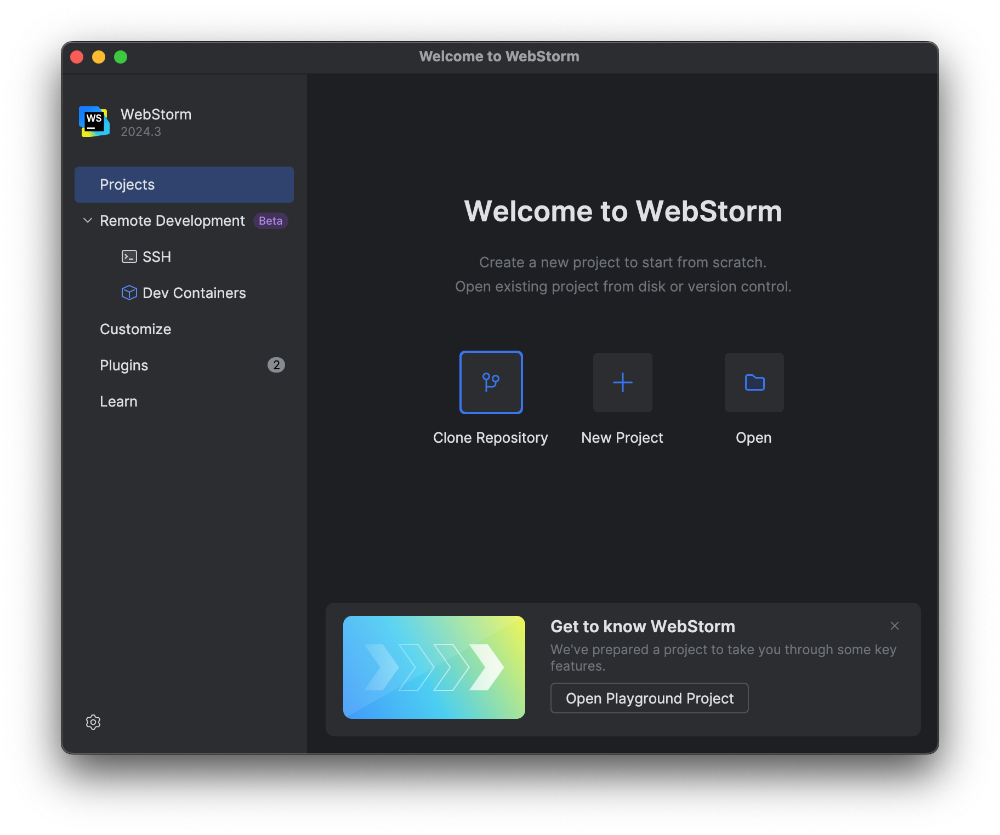

The first step is to press that "Clone Repository" button to clone the https://github.com/wevote/weconnect-server repository. 
Enter the URL and press the Clone button.  (Your clone dialog should look just like this, but will probably have a black
background instead of a white one!)

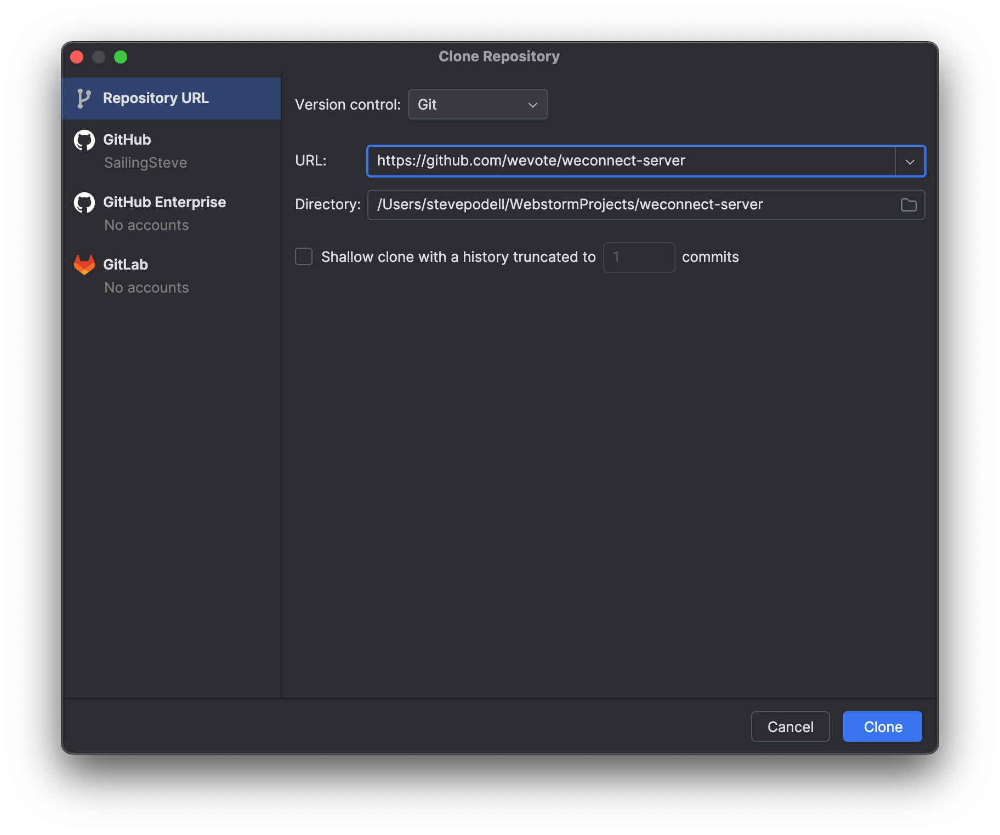

Now the latest code is on your machine.

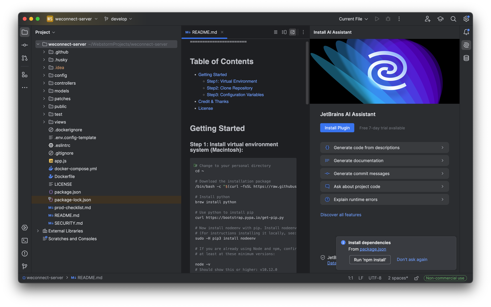
<br><br>

## Configure the WebStorm display mode
If you like the default white characters on a black background, skip this step.

Access the settings dialog from the gear icon in the upper right hand side of the WebStorm app.
Set the Theme as you would like to have it, or set it to "Sync with OS" (which is my preference), and then save.
<br><br>

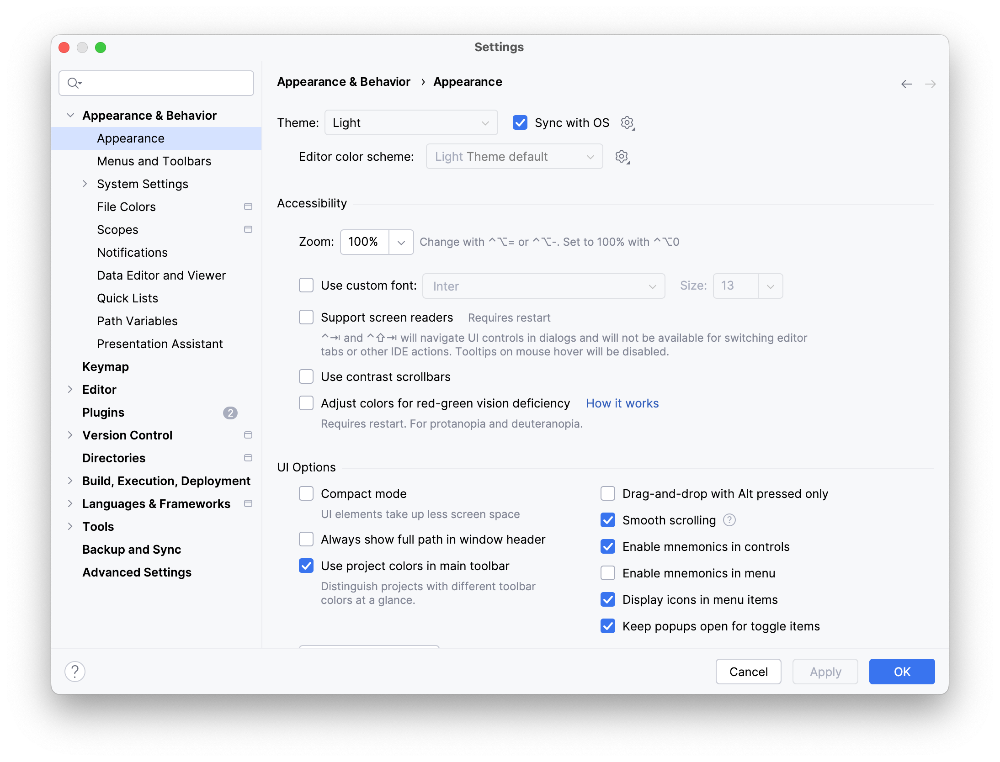
<br><br>

### About WebStorm plugins
Plugins extend the capability of WebStorm and are worth exploring.  If it sounds good, we usually install them, unless the suggestions are for off-topic for what we are using WebStorm for today.
Plugins suggested by WebStorm are safe to install, and easy to remove if you don't like them.
<br><br>

## Install Homebrew (If it is not already installed)
Open a terminal window by clicking on the terminal icon on the bottom left side of WebStorm, type `brew` and hit return, if brew is installed you can skip this step.

To Install [Homebrew](https://brew.sh/) paste this following command into the terminal, and press return

```bash
/bin/bash -c "$(curl -fsSL https://raw.githubusercontent.com/Homebrew/install/HEAD/install.sh)"
```
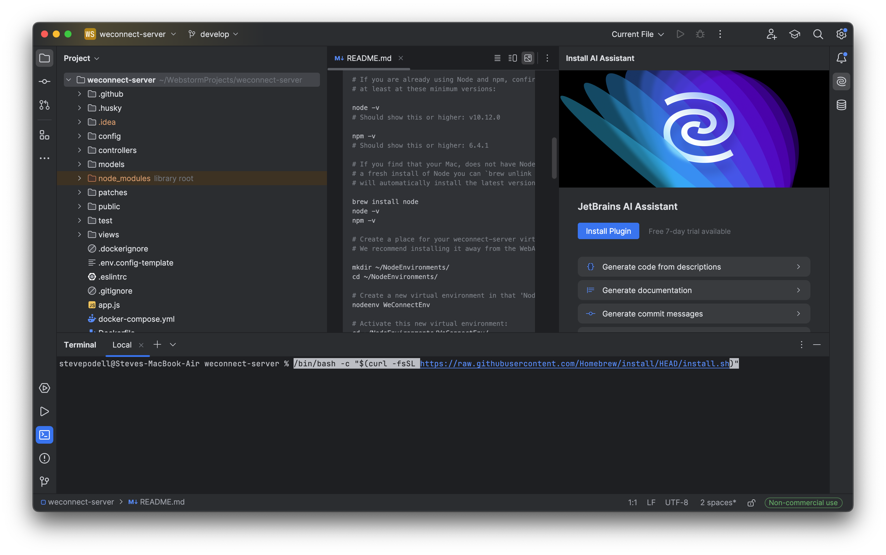

After a few minutes, homebrew will be installed.  You will now use Homebrew to install some more applications.
<br><br>

## Install Node
This project requires a minimun Node version v22.0<br>

If you have an earlier version of Node installed, you will need to reinstall it.

Check your node version via the WebStorm terminal (This computer was at V18, and needed to be upgraded.  Node had been previously installed with 
Homebrew.  We know Node was installed with Homebrew since "homebrew" is in the path to the Node executable (`/opt/homebrew/bin/node`).)

```
stevepodell@Steves-MacBook-Air weconnect-server % which node             
/opt/homebrew/bin/node
stevepodell@Steves-MacBook-Air weconnect-server % node -v
v18.10.0
stevepodell@Steves-MacBook-Air weconnect-server % 
```

If your computer did not have Node installed with Homebrew, you will have to research how to upgrade your installation of Node.

If Node was installed with Homebrew or you have never installed Node, continue...

```bash
  stevepodell@Steves-MacBook-Air weconnect-server % brew install node@22
  ...
  ==> Caveats
  node@22 is keg-only, which means it was not symlinked into /usr/local,
  because this is an alternate version of another formula.
   
  If you need to have node@22 first in your PATH, run:
     echo 'export PATH="/usr/local/opt/node@22/bin:$PATH"' >> ~/.zshrc

  For compilers to find node@22 you may need to set:
    export LDFLAGS="-L/usr/local/opt/node@22/lib"
    export CPPFLAGS="-I/usr/local/opt/node@22/include"
  ==> Summary
🍺  /usr/local/Cellar/node@22/22.11.0: 2,628 files, 83.7MB
  ==> Running `brew cleanup node@22`...
  Disable this behaviour by setting HOMEBREW_NO_INSTALL_CLEANUP.
  Hide these hints with HOMEBREW_NO_ENV_HINTS (see `man brew`).
  stevepodell@Steves-MacBook-Air weconnect-server % 
```
If Homebrew asks you to make the following 4 manual changes, in order to link in Node.  Execute these 4 lines in your WebStorm terminal window.
```bash
stevepodell@Steves-MacBook-Air weconnect-server % echo 'export PATH="/usr/local/opt/node@22/bin:$PATH"' >> ~/.zshrc
stevepodell@Steves-MacBook-Air weconnect-server % echo 'export PATH="/usr/local/opt/node@22/bin:$P                 
stevepodell@Steves-MacBook-Air weconnect-server % export LDFLAGS="-L/usr/local/opt/node@22/lib"
stevepodell@Steves-MacBook-Air weconnect-server % export CPPFLAGS="-I/usr/local/opt/node@22/include"
stevepodell@Steves-MacBook-Air weconnect-server % 
```
Then confirm the version of Node is greater than V22, open a new terminal window (with the "+" icon) and type

```
stevepodell@Steves-MacBook-Air weconnect-server % node -v
v22.11.0
stevepodell@Steves-MacBook-Air weconnect-server % 
```
<br><br>

## Set up your Git remotes within WebStorm

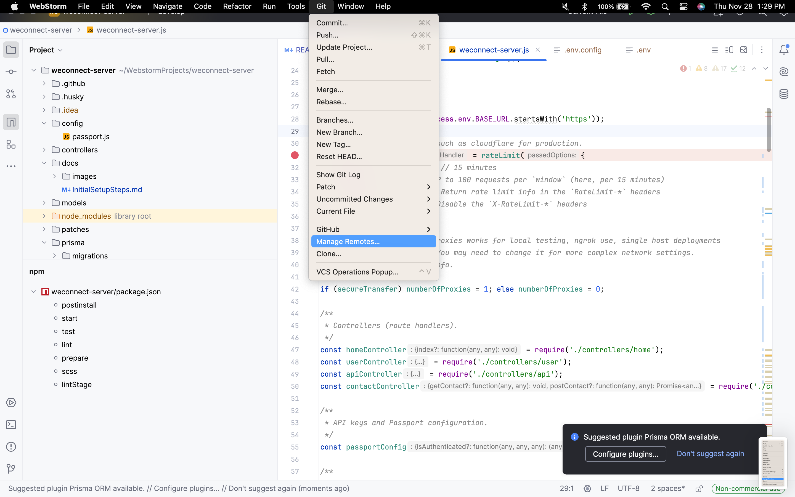

At WeVote we use different naming conventions for `origin` and `upstream` than you might be familiar with from other projects, 
so you will need to rename the default git origin (which at WeVote is your private branch in GitHub)

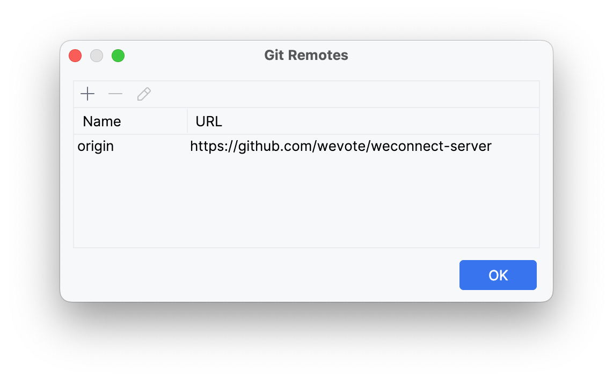

Edit the origin line, and change the name to upstream, then press OK

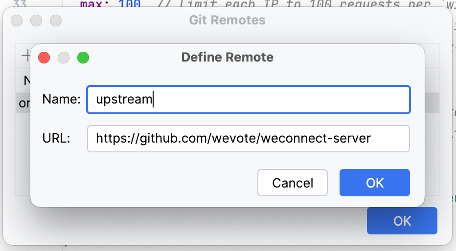

Then press the + button and set up the new value for “origin”. 
(DON’T USE SailingSteve — use your GitHub handle — the GitHub username that is in the URL after you sign in to GitHub .)

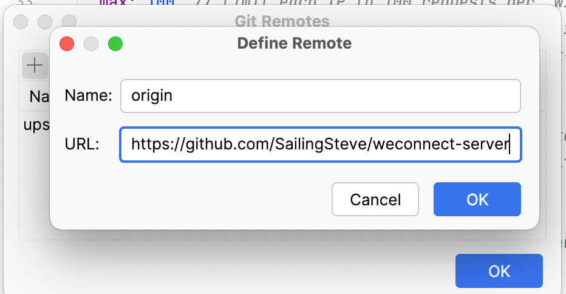

When done, your remotes will look something like this (with your GitHub handle instead of SailingSteve!)

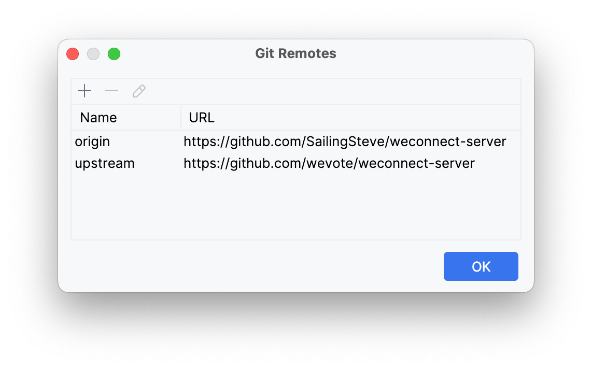

At this point you are poised to make Git branches and pull requests.
<br><br>

## Load all the Node packages that we use in the weconnect-server
If you haven't already done this via a prompt from Webstorm, type
```
stevepodell@Steves-MacBook-Air weconnect-server % npm install
```
You can run this command as often as you want, and it will cause no harm.
<br><br>

## Make a live copy of .env-template to the .env file

Right-click on the `.env-template` file in Webstorm, and paste it as `.env`

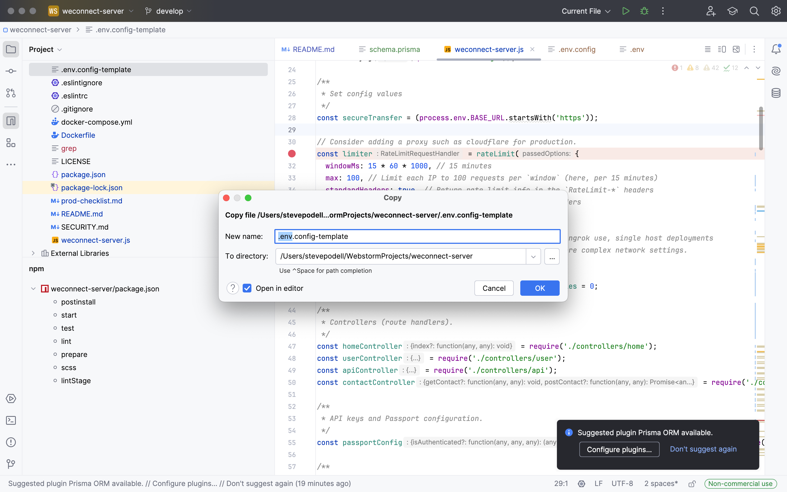

Open `.env` in WebStorm by double-clicking on it

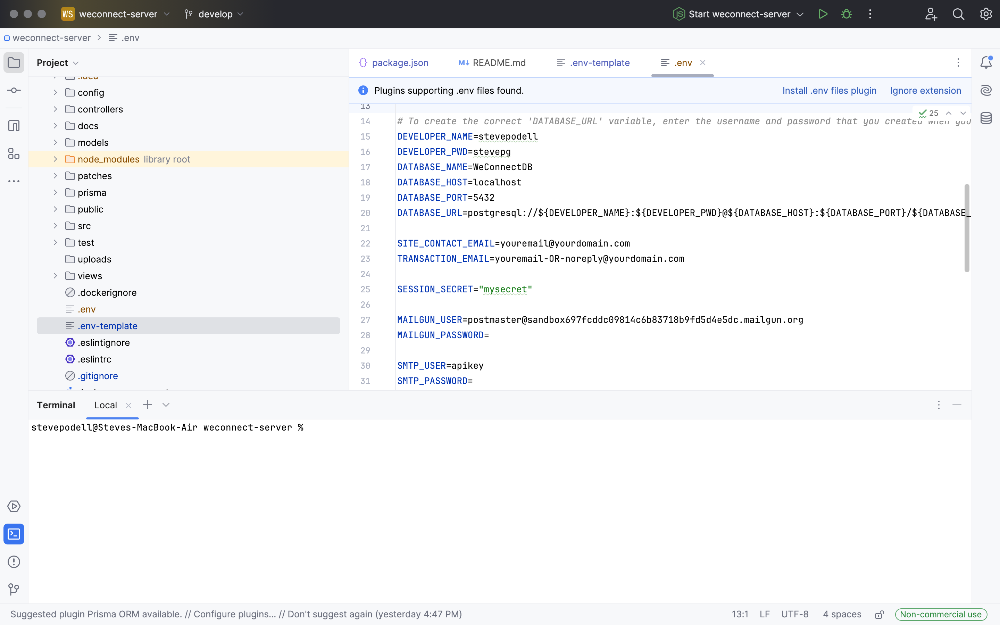

Modify the `DEVELOPER_NAME` and `DEVELOPER_PWD` lines by substituting the username and password that you created when you
setup postgres.
<br><br>


## Add a Run Configuration in WebStorm to start the weconnect-server

Open the pull-down that initially says "Current File", and select Edit Configurations
<br>
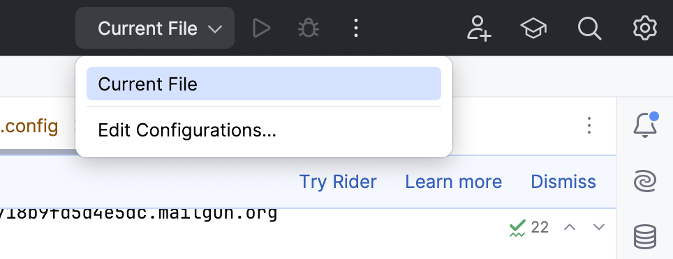<br>

In the Run/Debug Configurations dialog, press the "+" button and then select "Node.js"

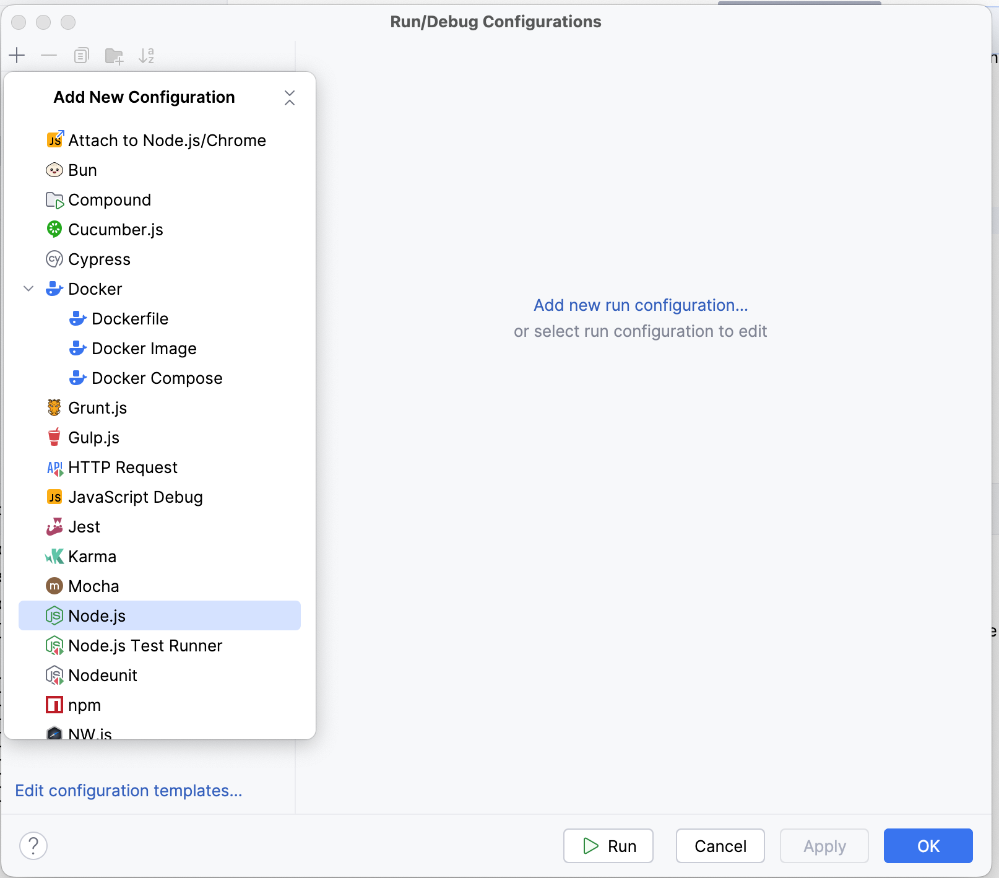<br>
Then fill in the run configuration... 
1) Enter `Start weconnect-server` in the Name field
2) Enter `weconnect-server.js` in the File field.
3) And press "OK" to save
<br>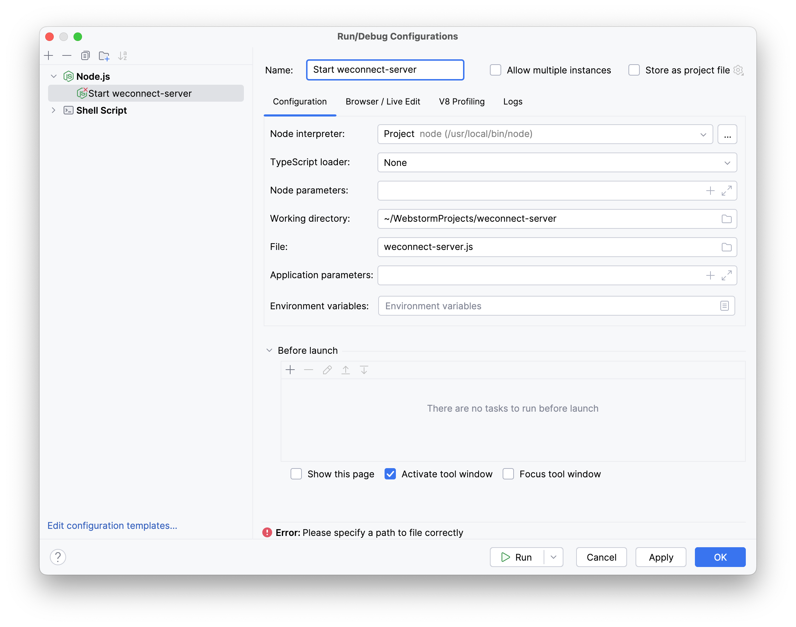
<br><br>


## Install or update postgres

Most developers install postgres using Homebrew, if you installed it some other way, there may be some things to figure out... :pensive:

We need to get PostgreSQL (postgres) and pgAdmin 4 installed.

Possible steps:
 * [If you know you have postgres installed, and it is running, and you have pgAdmin running:](#if-you-know-you-have-postgres-installed-and-it-is-running-and-you-have-pgadmin-running)
 * [If you are unsure if postgres is installed:](#if-you-are-unsure-if-postgres-is-installed)
 * [If you have never installed Postgres for any other project, including school projects:](#if-you-have-never-installed-postgres-for-any-other-project-including-school-projects)
 * [If you need to install pgAdmin4 a Mac based browser app for the postgres database:](#if-you-need-to-install-pgadmin4-a-mac-based-browser-app-for-the-postgres-database)


### If you know you have postgres installed and it is running, and you have pgAdmin running

Within pgAdmin 4, under the server that you have running (which will probably be named WeVoterServer if you worked on other WeVote projects)...

1) On the left hand 'Servers' Right Click on Databases
2) On the right-click menu, select 'Create'
3) In the 'Database...' field, enter "WeConnectDB"

That's it, you are ready to continue on setting up the weconnect-server

This picture shows the WeVoteServer in Postgres that was previously setup for the WeVoteServerDB (Python API Server), with an additional database
that you just created for WeConnectDB.  (No problem at all, if you don't have a WeVoteServerDB)

<br>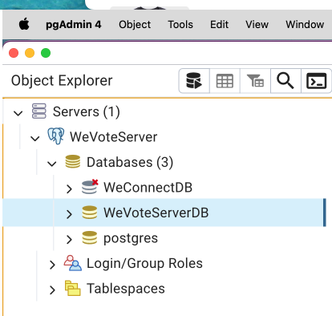


Next step: [Use the Prisma ORM to migrate the weconnect-server table definitions to the WeConnectDB database:](#use-the-prisma-orm-to-migrate-the-weconnect-server-table-definitions-to-the-weconnectdb-database)


### If you are unsure if postgres is installed

1) Determine if postgres is installed by entering `which postgres` in a terminal window (at the bottom of Webstorm)  
if you see a path to postgres, it is installed (and hopefully you will see homebrew in that path -- which makes things easier)

<br>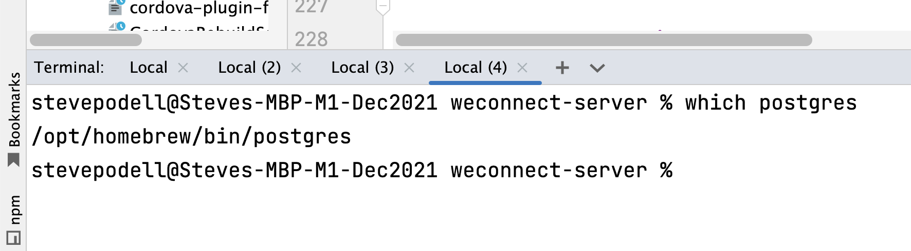

This command line result shows that postgres has been installed by homebrew, if no path to postgres is displayed, then postgres has not been previously installed

If postgres is installed, determine if it is already running with the macOS command 'pgrep -l postgres'

```
stevepodell@Steves-MBP-M1-Dec2021 weconnect-server % pgrep -l postgres
2472 postgres
2474 postgres
...
43971 postgres
43972 postgres
43973 postgres
43974 postgres
43977 postgres
stevepodell@Steves-MBP-M1-Dec2021 weconnect-server % 
```

If you see a number of different macOS processes running, that means that postgres is running. 

If this is the case go back to [If you know you have postgres installed and it is running and you have pgAdmin running:](#if-you-know-you-have-postgres-installed-and-it-is-running-and-you-have-pgadmin-running)

If postgres is installed, but not running, in a terminal within WebStorm, start postgres running as a daemon service:
```
stevepodell@Steves-MacBook-Air weconnect-server %  brew services start postgresql@14
==> Successfully started `postgresql@14` (label: homebrew.mxcl.postgresql@14)
stevepodell@Steves-MacBook-Air weconnect-server % 
```

Next confirm that you have pgAdmin 4 installed.  In spotlight type 'pgAdmin 4.app' if you find it, start it up.
Otherwise, go to [If you need to install pgAdmin4 a Mac based browser app for the postgres database:](#if-you-need-to-install-pgadmin4-a-mac-based-browser-app-for-the-postgres-database)
After installing pgAdmin 4, go to [If you know you have postgres installed and it is running and you have pgAdmin running] and follow those directions.

### If you have never installed Postgres for any other project including school projects
Use home brew to install postgres Version 14, the point version does not matter.  It can take a few minutes for brew to complete.
```
stevepodell@Steves-MacBook-Air weconnect-server %brew install postgresql@14
... Homebrew logs a whole bunch of lines about updating formulas, fetching, downloading, and pouring formulae...
... then finally it logs ...
This formula has created a default database cluster with:
  initdb --locale=C -E UTF-8 /usr/local/var/postgresql@14

To start postgresql@14 now and restart at login:
  brew services start postgresql@14
Or, if you don't want/need a background service you can just run:
  /usr/local/opt/postgresql@14/bin/postgres -D /usr/local/var/postgresql@14
stevepodell@Steves-MacBook-Air weconnect-server % 
```
Those lines at the end provide useful information.  
* initdb was run to create a bare minimum database for postgres, so it can store privileges, logins, and other configuration info.
* if you want to run postgres as a daemon service (so it is always running in the background), you can use this command in 
  a webstorm terminal window <br />`brew services start postgresql@14`<br /> and then ever your Mac is running, postgres will then be running
  (If you want to stop it running as a background service just type <br />`brew services stop postgresql@14`)
* Alternatively, if you just want to be able to turn on postgres when you want it (and not have it run as a daemon service) use this command in a Webstorm terminal<br/>
  `/usr/local/opt/postgresql@14/bin/postgres -D /usr/local/var/postgresql@14` <br />and when you are done, press Ctrl+C in that terminal
  window to stop postgres.

Now start postgres running as a daemon service:
```
stevepodell@Steves-MacBook-Air weconnect-server %  brew services start postgresql@14
==> Successfully started `postgresql@14` (label: homebrew.mxcl.postgresql@14)
stevepodell@Steves-MacBook-Air weconnect-server % 
```

### If you need to install pgAdmin4 a Mac based browser app for the postgres database
Skip this step if pgAdmin 4 is already installed!

```
stevepodell@Steves-MacBook-Air weconnect-server % brew install --cask pgadmin4
```
This will take a few minutes, when it completes launch the app from Launch Pad or Spotlight

Register the server as WeVoteServer

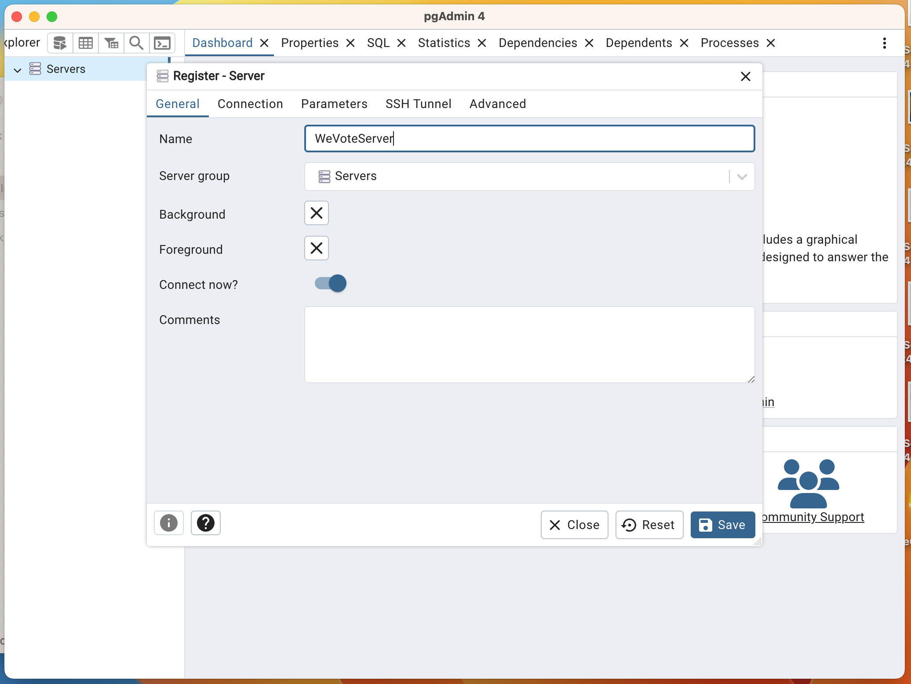

And in the Connection tab set the Host name as localhost — also add any easy to remember postgres Username and Password, then save

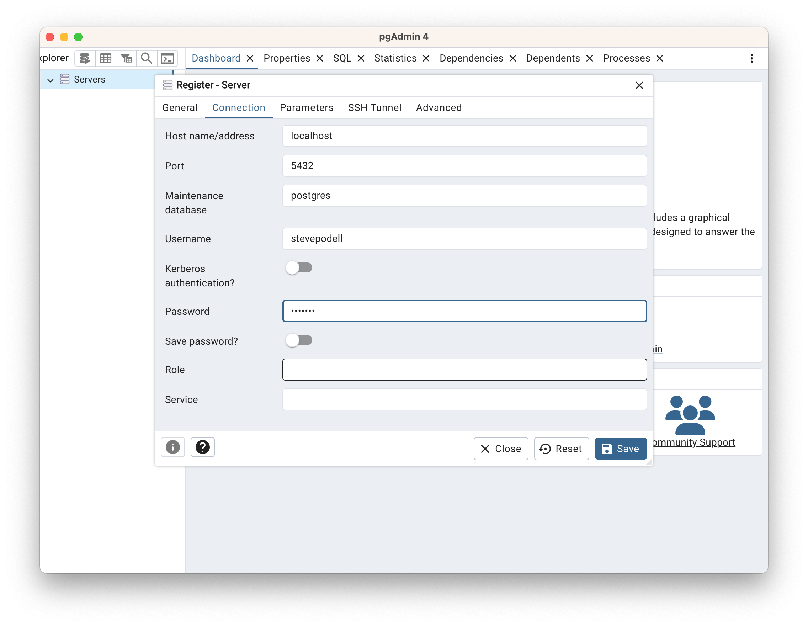
<br><br>

Your database is now registered with pgAdmin 4!

(If you already had Postgres installed, you will have other databases on the Databases list, this is not a problem, just continue
with this step to create a new one for the weconnect-server.)

NOTE 4/25/25:  This instruction is not necessary, since the later 'prisma migrate' command automatically creates the DB:  ~~On the left pane "Object Explorer" right click on "Databases" and add the "WeConnectDB".  An empty "WeConnectDB" has been created.~~

Continue on to setup the Prisma ORM.

## Use the Prisma ORM to migrate the weconnect-server table definitions to the WeConnectDB database
(This is the next step after getting postgres and pgAdmin 4 installed and running)

Generate the schema from prisma/schema.prisma to node_modules. Note that if `prisma generate` doesn't work, try `npx prisma generate` as well as `npx prisma migrate dev --name init`.
```
stevepodell@Steves-MacBook-Air weconnect-server % prisma generate
Environment variables loaded from .env
Prisma schema loaded from prisma/schema

✔ Generated Prisma Client (v6.5.0) to ./node_modules/@prisma/client in 234ms

Start by importing your Prisma Client (See: https://pris.ly/d/importing-client)

Tip: Want to turn off tips and other hints? https://pris.ly/tip-4-nohints

stevepodell@Steves-MacBook-Air weconnect-server %
```

Initialize the generated schema into the postgres database server.
```
stevepodell@Steves-MacBook-Air weconnect-server % prisma migrate dev --name init
Environment variables loaded from .env
Prisma schema loaded from prisma/schema
Datasource "db": PostgreSQL database "WeConnectDB", schema "public" at "localhost:5432"

Applying migration `20250313234927_init`

The following migration(s) have been created and applied from new schema changes:

migrations/
  └─ 20250313234927_init/
    └─ migration.sql

Your database is now in sync with your schema.

✔ Generated Prisma Client (v6.5.0) to ./node_modules/@prisma/client in 211ms

stevepodell@Steves-MacBook-Air weconnect-server %  

```
<br><br>

## Add `wevotedeveloper.com` to your /etc/hosts file

Use a macOS command line text editor to edit the `/etc/hosts` file.   Edit the `/etc/hosts` file with nano (or vi or vim).

`sudo nano /etc/hosts`

The nano editor is easiest to use if you are unfamiliar with vi or vim editors.  Use the same password that you use to log into your 
Mac when prompted by sudo, then once in the nano text editor make your changes, and then press  Ctrl+o (to save the changes)
and Ctrl+x (to quit).

In the editor add `wevotedeveloper.com` at the end of the first line, so that your /etc/hosts file looks something like this:  

```
127.0.0.1       localhost wevotedeveloper.com
255.255.255.255 broadcasthost
::1             localhost
```

## Start the app!

Prior to starting the app, you need to get the SSL certificates that allow the server to run in 'https' mode.
We don't want to publish these certificates in our git repository, but you can get them from anyone on your team or from Dale.
The file names are `wevotedeveloper.com.crt` and `wevotedeveloper.com_key.txt` -- put them in the weconnect-server/cert directory.

Postgres should be running, due to your earlier steps, if it is not running all API queries from weconnect-client will fail.

Then start weconnect-server.js with the run configuration.


[//]: # (<br><br>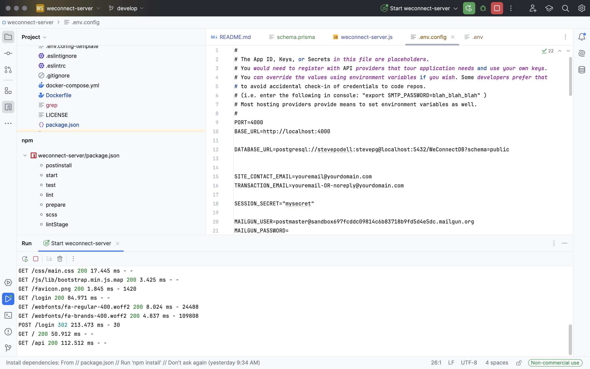)

As you can see when you press the Green start arrow, the server starts up in a terminal window where you can see 
logging.  Any `console.log()` lines that you put in the code will appear in this JavaScript console for this Node based server (which has no DOM).  

Alternatively if you press the green bug icon, you start a debugging session, where you can set breakpoints, examine threads,  and examine data
in a familiar way to what you might be used to with Chrome Dev Tools (Inspect) or debugging in PyCharm.

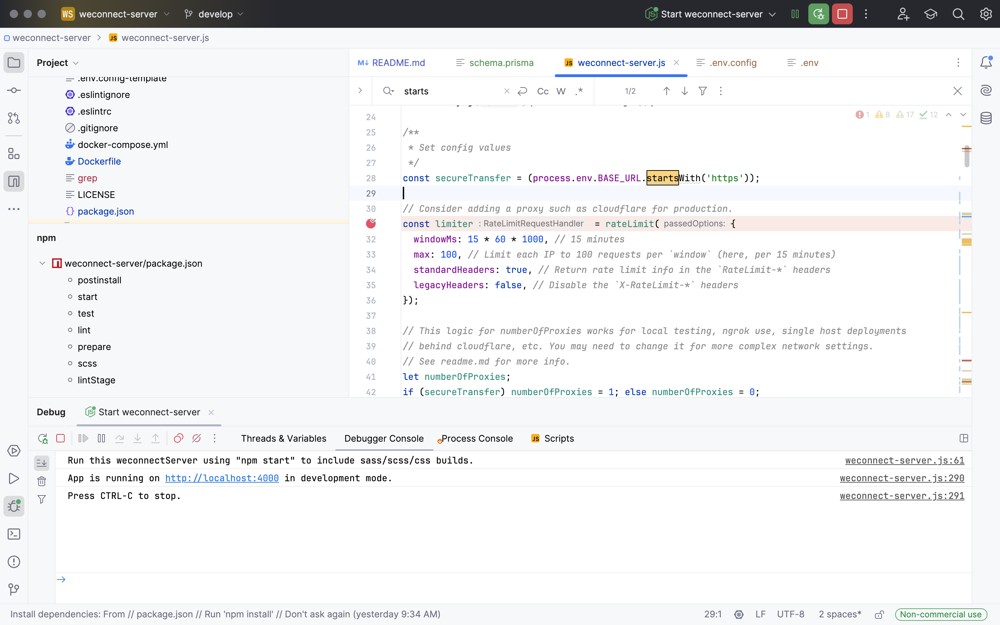
<br><br>

## Create a default admin user

Run the createDevUser node script. You can use any name and password you want!

`createDevUser {firstName} {lastName} {email} {password}`

example:

```
stevepodell@Steves-MBP-M1-Dec2021 node_scripts % cd ..
stevepodell@Steves-MBP-M1-Dec2021 weconnect-server % node ./node_scripts/createDevUser Samuel Adams samuel@adams.com ale
person created id # 365
stevepodell@Steves-MBP-M1-Dec2021 weconnect-server % 
```

## View the app in the Chrome browser

When you navigate in Chrome to `https://wevotedeveloper.com:4500/` you will see a basic status page for 
the client view of the wevote-server app -- The purpose of the page is to confirm that the weconnect-server is up
and responding to https requests.

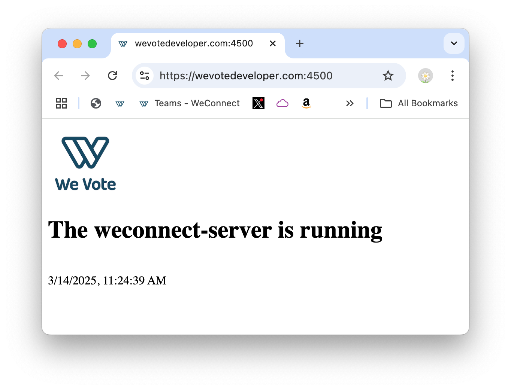

At this point you have a running weconnect-server, and you can proceed to the installation of the [https://github.com/wevote/weconnect-client](https://github.com/wevote/weconnect-client).


### Debugging Postgres Server Problems

see [advancedPostgresSetup.md](docs/advancedPostgresSetup.md)


### Not now, but when you want to add a column in the future
**Don't do this now!**

But someday, when you add a column or a new schema (table)...

After editing or creating your schema/?.prisma file

run `prisma migrate dev`

### Credits &amp; Thanks
---------------

Mad respect to [Hackathon Starter](https://github.com/sahat/hackathon-starter)

License
-------

The MIT License (MIT)

Copyright (c) 2024 We Vote USA
Forked from Hackathon Starter Copyright (c) 2024 Sahat Yalkabov
Permission is hereby granted, free of charge, to any person obtaining a copy of this software and associated documentation files (the "Software"), to deal in the Software without restriction, including without limitation the rights to use, copy, modify, merge, publish, distribute, sublicense, and/or sell copies of the Software, and to permit persons to whom the Software is furnished to do so, subject to the following conditions:
The above copyright notice and this permission notice shall be included in all copies or substantial portions of the Software.
THE SOFTWARE IS PROVIDED "AS IS", WITHOUT WARRANTY OF ANY KIND, EXPRESS OR IMPLIED, INCLUDING BUT NOT LIMITED TO THE WARRANTIES OF MERCHANTABILITY, FITNESS FOR A PARTICULAR PURPOSE AND NONINFRINGEMENT. IN NO EVENT SHALL THE AUTHORS OR COPYRIGHT HOLDERS BE LIABLE FOR ANY CLAIM, DAMAGES OR OTHER LIABILITY, WHETHER IN AN ACTION OF CONTRACT, TORT OR OTHERWISE, ARISING FROM, OUT OF OR IN CONNECTION WITH THE SOFTWARE OR THE USE OR OTHER DEALINGS IN THE SOFTWARE.

