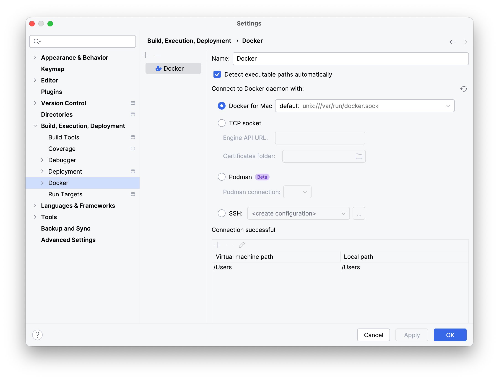
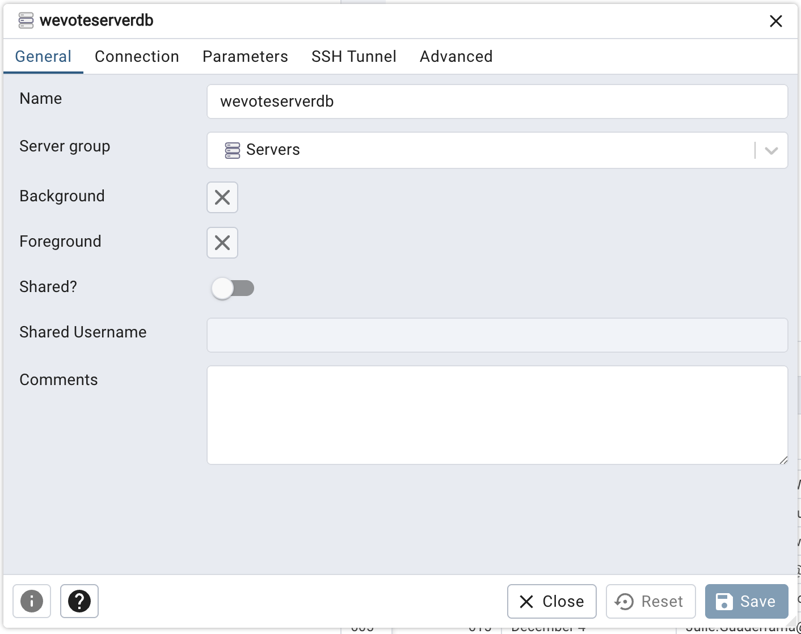
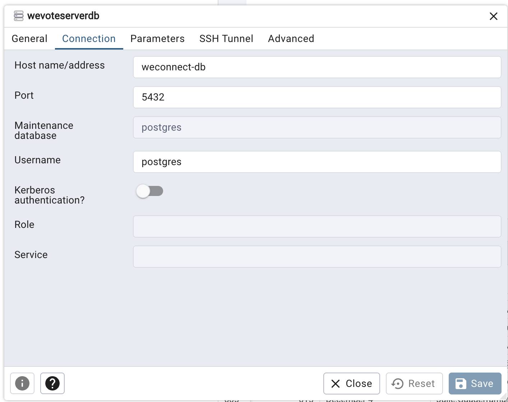

# Docker Local Development Setup

This guide explains how to run weconnect-server in a local Docker environment.

## Prerequisites

- [Docker Desktop](https://www.docker.com/products/docker-desktop/) (or Docker Engine + Compose plugin on Linux)
- Git

## Quick Start

### 1. Create the shared Docker network

All WeVote services (WeVoteServer, WebApp, weconnect-server) share a Docker network named `wevote`. Create it once:

```sh
docker network create wevote
```

### 2. Configure environment variables and install the SSL certificates

Copy the template and fill in your values:

```sh
cp .env-template .env
```

We have real commercial SSL certs from 'Sectigo' for wevotedeveloper.com

You can download them from https://drive.google.com/drive/folders/1q0KB2B8HB-AGTMLXrYq7x96McaEJ9_od?usp=drive_link

If you don't have access to this drive, talk to your team leader.

The two files are `wevotedeveloper.com_key.txt` and `wevotedeveloper.com.crt`

Copy them to your cert directory  WeVoteServer/cert

Then change your .env file to be

```sh
# .env
DATABASE_USER=postgres
DATABASE_PASSWORD=admin
HTTPS_SSL_CERT=./cert/wevotedeveloper.com.crt
HTTPS_SSL_KEY=./cert/wevotedeveloper.com_key.txt
```

### 3. Build and start the services

```sh
docker compose up --build
```
This command is needed for initial startup, and after any changes to the Docker configuration files {compose.yaml, Dockerfile.dev, entrypoint, etc} and
after any changes to package.json -- it rebuilds the Docker Containers that are used to load the app and postgres.

This will:
1. Start a PostgreSQL database
2. Wait for the database to be healthy
3. Start pgAdmin4 running on http://localhost:7000/browser/  (On a Mac, you may need to open this with Safari)
4. Run `prisma generate` and `prisma migrate deploy` to apply all migrations
5. Run `npm install` to get the configured library versions into the Docker layer.
6. Start the weconnect-server with nodemon (auto-reloads on file changes)

The API will be available at **https://wevotedeveloper.com:4500/**.

To run in the background:

```sh
docker compose up --build -d
```

### 4. Stop the services

```sh
docker compose down
```

To also remove the database volume (deletes all data):

```sh
docker compose down -v
```

## Development Workflow

### Live code reloading

The source directory is mounted into the container at `/app`, so edits you make on the host are reflected immediately. `nodemon` watches for changes and restarts the server automatically.

### Running Prisma commands

To run Prisma commands inside the running container:

```sh
# Open a shell in the api container
docker compose exec weconnect-api sh

# Open a shell in the db container (rarely needed, to run psql)
docker compose exec weconnect-db sh

# Then run Prisma commands
npx prisma studio          # visual database browser at http://localhost:5555
npx prisma migrate dev     # create a new migration
npx prisma db seed         # run seed script (if configured)
```

Or run them directly without opening a shell:

```sh
docker compose exec weconnect-api npx prisma studio
docker compose exec weconnect-api npx prisma migrate dev --name my_migration
```

### Running tests

```sh
docker compose exec weconnect-api npm test
```

### Viewing logs

```sh
docker compose logs -f weconnect-api    # follow api logs
docker compose logs -f weconnect-db     # follow database logs
```

You can also see these logs in docker.desktop, and in a terminal (possibly within WebStorm) in which you ran the `docker compose up` command.  

## Troubleshooting

* **If `docker network create wevote` fails with "already exists"**, the network already exists — this is fine, proceed to the next step.

* **Prisma migration fails on startup**
Check that the database settings are correct in `.env`. Run `docker compose logs weconnect-db` to inspect database errors.

* If you see **`node_modules` issues or package errors**
Rebuild the image to reinstall dependencies:

```sh
docker compose build --no-cache 
docker compose up
```

## Running and Debugging in WebStorm
* Make sure your WebStorm is updated to the latest version, at least to "WebStorm 2025.2.6.1"
* The WebStorm Docker plugin is bundled with this version and later.

### 1. Connect WebStorm to your Docker Daemon

1) Open settings using **Ctrl + Alt + S* (Windows/Linux) or **Cmd +** , (macOS).
2) Navigate to **Build, Execution, Deployment | Docker**.
3) Click the **+** icon to add a Docker server.   (This is what it looks like on macOS)



4) Press **Ok** to save the docker server connection.

### 2. Create an "Attach to Node" Run Configuration

1) Go to the main menu and select **Run | Edit Configurations**.
2) Click the **+ (Add New Configuration)** button and select **Attach to Node.js/Chrome**.
3) Name the run configuration something like `Attach to Docker API`
3) Host needs to be `localhost`
4) Port needs to be `9229`
5) DO NOT CHECK "Reconnect automatically"  
4) Setup a "Remote URLs of local files" entry.  Press the **+** to open a blank URL mapping line.
5) A file selection dialog will appear.  Select the `weconnect-server.js` file.  (Leave the default `http://localhost:9229` Remote URL as is.)
5) Click **OK** to save the configuration
6) Start the Docker setup with the `docker compose up` command in a terminal.
6) Once the `Container weconnect-server-weconnect-db-1` starts up, you can press the Debug "bug" icon, in Webstorm for the "Attach to Docker API", and you will be debugging.  Set a breakpoint, run your API call and execution should stop at the breakpoint.


**Note about ephemeral containers:** In Docker.desktop, under `weconnect-server`, you will see the `weconnect-api-1` container and the `weconnect-db-1` container, and while
debugging you may see ephemeral (temporary anonymous) containers like `unruffled_shannon` while debugging -- these 
containers are debugging related and can be ignored.

## PgAdmin
### 1. Access PgAdmin Container
Go to `http://localhost:7000/browser/` in your local web browser to access the `PgAdmin` container UI.  If you used all the default environment variables (in the `.env` file): on PgAdmin login screen, your "Email Address/Username" will be `fake_email@wevoteeducation.org` and your password will be `admin`.  (Note from August 2026: I needed to use Safari on my Mac to connect to pgAdmin, consider this as a workaround if you are having trouble connecting.)
### 2. Register New Server
1. Right-click on 'Servers' in the left pane, and select Register/Server.

[//]: # ()

3. Set the Server **Name** to `wevoteserverdb` (unless you overrode it in the `.env` value for `DATABASE_NAME`.)



5. Set up the server connection (click the second tab 'Connection')
* Host name/address: `weconnect-db`
* Port: `5432`
* Maintenance database: `postgres`
* Username: `postgres`
* Password: `admin`

[//]: # (https://github.com/wevote/WeVoteServer/blob/develop/docs/README_API_INSTALL_POSTGRES_MAC.md)

[//]: # ()




6. **Only if pgadmin does not recognize your password for 'Register New Server'**, see the following section titled <ins>If 'Add New Server' does not accept the password for your postgres user</ins>, to do a password reset for the maintenance database user 'postgres'.

6. Click Save

## If 'Add New Server' does not accept the password for your postgres user

Open a terminal in the `db` container:

```sh
docker compose exec weconnect-db sh
```

In the terminal
1. Enter the bash shell, by entering 'bash'
2. Start the PSQL command line app, by entering 'psql'
3. Enter the SQL command to change the password by entering `ALTER USER postgres WITH PASSWORD 'admin';`
4. Then exit PSQL by entering 'exit'
